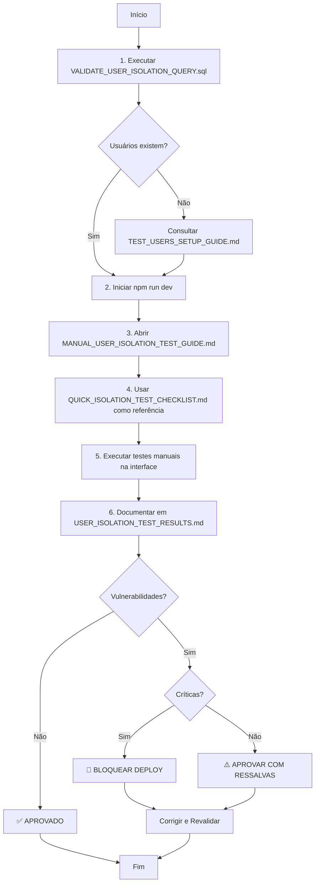

# 📊 SUMÁRIO - VALIDAÇÃO DE ISOLAMENTO DE DADOS

## 🎯 OBJETIVO DA TAREFA

Validar via **testes manuais na interface** que o isolamento de dados entre roles está funcionando corretamente no DEAPDI TalentFlow.

---

## 📚 ARQUIVOS CRIADOS

### 1. `VALIDATE_USER_ISOLATION_QUERY.sql`
**Propósito:** Script SQL para verificar usuários de teste existentes e validar isolamento no banco.

**Como usar:**
```bash
psql <connection_string> -f VALIDATE_USER_ISOLATION_QUERY.sql
```

**O que faz:**
- ✅ Lista usuários de teste (@example.com e @deapdi-test.local)
- ✅ Verifica cobertura de roles (employee, manager, hr, admin)
- ✅ Valida hierarquias (gestores e subordinados)
- ✅ Checa dados associados (PDIs, check-ins, grupos, mentorias)
- ✅ Executa testes críticos de isolamento no banco
- ✅ Gera checklist de cobertura

**Seções principais:**
1. Verificar usuários existentes
2. Dados associados aos usuários
3. Validações de isolamento
4. Testes de isolamento críticos
5. Checklist de cobertura

---

### 2. `MANUAL_USER_ISOLATION_TEST_GUIDE.md`
**Propósito:** Guia detalhado passo a passo para testes manuais na interface.

**Estrutura:**
- 📋 Pré-requisitos (usuários, ambiente, navegadores)
- 🖥️ Setup de navegadores (4 janelas/navegadores)
- 🧪 **TESTE 1: EMPLOYEE** (Colaborador)
  - PDIs próprios
  - Check-ins emocionais
  - Gestão de pessoas (bloqueado)
  - Favoritos
- 🧪 **TESTE 2: MANAGER** (Gestor) ⚠️ MAIS CRÍTICO
  - Visualizar subordinados diretos
  - PDIs dos subordinados
  - **Check-ins de subordinados (DEVE ESTAR BLOQUEADO)**
  - Competências da equipe
- 🧪 **TESTE 3: HR** (Recursos Humanos)
  - Todos os colaboradores
  - Todos os PDIs
  - Dashboard de saúde mental (acesso total)
  - Registros psicológicos
  - Relatórios
- 🧪 **TESTE 4: ADMIN** (Administrador)
  - Acesso completo
  - Gerenciamento de usuários
  - Audit logs
  - Configurações do sistema
- 🚨 **TESTES CRUZADOS**
  - Vazamento via URL direta
  - Vazamento via API
  - Escalação de privilégios

**Total de páginas:** ~60 linhas detalhadas

---

### 3. `USER_ISOLATION_TEST_RESULTS.md`
**Propósito:** Template para documentação dos resultados dos testes.

**Estrutura:**
- ✅ Preparação (usuários selecionados)
- 🖥️ Configuração do ambiente
- 🧪 Resultados dos testes (tabelas para preencher)
- 🚨 Vulnerabilidades encontradas (com screenshots)
- 📊 Resumo executivo (matriz de isolamento)
- 🎯 Recomendações (ações imediatas, curto/médio prazo)
- ✅ Conclusão final (aprovado/reprovado)
- 📎 Anexos (screenshots, logs, queries)

**Pronto para preencher:** Todas as tabelas já estão formatadas.

---

### 4. `QUICK_ISOLATION_TEST_CHECKLIST.md`
**Propósito:** Checklist rápido de uma página para execução ágil.

**Conteúdo:**
- ⚡ Preparação rápida (5 min)
- 🖥️ Setup simplificado (5 min)
- ✅ Checklist por role (30-45 min)
- 🚨 Testes cruzados (10 min)
- 📊 Resultado final
- 🚨 Vulnerabilidades
- ✅ Decisão final
- 🔥 Prioridades se falhar

**Tempo total:** 45-60 minutos

---

## 🎯 FLUXO DE EXECUÇÃO RECOMENDADO



---

## 📋 MATRIZ DE ISOLAMENTO ESPERADA

| Recurso | Employee | Manager | HR | Admin |
|---------|----------|---------|-----|-------|
| **PDIs** |
| Ver próprios PDIs | ✅ | ✅ | ✅ | ✅ |
| Ver PDIs de subordinados | ❌ | ✅ | ✅ | ✅ |
| Ver todos os PDIs | ❌ | ❌ | ✅ | ✅ |
| **Check-ins Emocionais** |
| Ver próprios check-ins | ✅ | ✅ | ✅ | ✅ |
| Ver check-ins de subordinados | ❌ | **❌** | ✅ | ✅ |
| Ver todos os check-ins | ❌ | ❌ | ✅ | ✅ |
| **Registros Psicológicos** |
| Ver próprios registros | ✅ | ✅ | ✅ | ✅ |
| Ver registros de outros | ❌ | ❌ | ✅ | ✅ |
| **Gestão de Pessoas** |
| Ver subordinados | ❌ | ✅ | ✅ | ✅ |
| Ver todos colaboradores | ❌ | ❌ | ✅ | ✅ |
| **Competências** |
| Ver próprias competências | ✅ | ✅ | ✅ | ✅ |
| Avaliar subordinados | ❌ | ✅ | ✅ | ✅ |
| Ver todas competências | ❌ | ❌ | ✅ | ✅ |
| **Favoritos** |
| Ver próprios favoritos | ✅ | ✅ | ✅ | ✅ |
| Ver favoritos de outros | ❌ | ❌ | ❌ | ✅ |
| **Administração** |
| Gerenciar usuários | ❌ | ❌ | ⚠️ | ✅ |
| Ver audit logs | ❌ | ❌ | ❌ | ✅ |
| Configurações sistema | ❌ | ❌ | ❌ | ✅ |

**Legenda:**
- ✅ = Deve ter acesso
- ❌ = NÃO deve ter acesso
- ⚠️ = Dependente da configuração
- **❌** = **TESTE CRÍTICO** (privacidade)

---

## 🚨 PONTOS CRÍTICOS DE ATENÇÃO

### 1. Manager NÃO deve ver check-ins de subordinados
**Severidade:** 🔴 CRÍTICA

**Razão:** Violação grave de privacidade. Dados psicológicos são confidenciais mesmo para gestores.

**Como testar:**
1. Login como manager
2. Tentar acessar `Saúde Mental` → `Check-ins`
3. NÃO deve listar subordinados
4. Tentar URL direta de check-in de subordinado
5. Deve retornar erro 403

**Se falhar:**
- 🚨 Bloquear deploy imediatamente
- 🔧 Revisar RLS da tabela `emotional_checkins`
- 🔧 Garantir política: `employee_id = auth.uid() OR role IN ('hr', 'admin')`

---

### 2. Employee NÃO deve ver dados de colegas
**Severidade:** 🔴 CRÍTICA

**Razão:** Vazamento de dados pessoais e profissionais.

**Como testar:**
1. Login como employee
2. Tentar acessar URLs diretas de recursos de outros
3. Verificar APIs no DevTools (Network)
4. Garantir que respostas contêm apenas dados próprios

**Se falhar:**
- 🚨 Revisar todas as políticas RLS
- 🔧 Garantir filtro por `auth.uid()` em todas as queries
- 🔧 Revisar services e funções RPC

---

### 3. APIs não devem retornar dados extras
**Severidade:** 🟡 ALTA

**Razão:** Mesmo que a UI não mostre, dados na resposta podem ser extraídos.

**Como testar:**
1. Abrir DevTools → Network em cada role
2. Fazer requisições (listar PDIs, check-ins, etc.)
3. Inspecionar JSON das respostas
4. Verificar se contém apenas dados permitidos

**Se falhar:**
- 🔧 Adicionar filtros no backend
- 🔧 Revisar SELECT queries
- 🔧 Garantir que RLS está ativo

---

### 4. URLs diretas devem respeitar permissões
**Severidade:** 🟡 ALTA

**Razão:** Manipulação de URLs pode permitir acesso não autorizado.

**Como testar:**
1. Copiar URLs de recursos de um usuário
2. Tentar acessar com outro usuário não autorizado
3. Deve retornar 403, redirecionar, ou página vazia

**Se falhar:**
- 🔧 Adicionar validações no frontend
- 🔧 Garantir que backend valida permissões
- 🔧 Implementar guards de rota

---

### 5. Não deve ser possível escalar privilégios
**Severidade:** 🔴 CRÍTICA

**Razão:** Usuário comum não pode se tornar admin.

**Como testar:**
1. Login como employee
2. Tentar modificar próprio role via API
3. Deve retornar erro 403

**Se falhar:**
- 🚨 PROBLEMA GRAVÍSSIMO
- 🔧 Revisar políticas de UPDATE em profiles
- 🔧 Garantir que apenas HR/Admin podem modificar roles

---

## 📊 MÉTRICAS DE SUCESSO

### Critérios de Aprovação

**✅ APROVADO SE:**
- ✅ 100% dos testes de Employee passaram
- ✅ 100% dos testes de Manager passaram
- ✅ Manager NÃO vê check-ins de subordinados
- ✅ 100% dos testes de HR passaram
- ✅ 100% dos testes de Admin passaram
- ✅ Testes cruzados passaram
- ✅ APIs retornam apenas dados permitidos
- ✅ URLs diretas respeitam permissões

**⚠️ APROVADO COM RESSALVAS SE:**
- ⚠️ Vulnerabilidades de severidade BAIXA ou MÉDIA encontradas
- ⚠️ Problemas de UX (mas sem vazamento de dados)
- ⚠️ Performance lenta (mas isolamento OK)

**❌ REPROVADO SE:**
- ❌ Manager consegue ver check-ins de subordinados
- ❌ Employee consegue ver dados de outros employees
- ❌ APIs retornam dados não autorizados
- ❌ URLs diretas permitem acesso indevido
- ❌ Possível escalar privilégios

---

## 🛠️ AÇÕES PÓS-TESTE

### Se APROVADO:
1. ✅ Arquivar documentação
2. ✅ Marcar milestone como concluída
3. ✅ Seguir para próxima fase (testes de performance)
4. ✅ Documentar boas práticas encontradas

### Se APROVADO COM RESSALVAS:
1. ⚠️ Criar issues para cada problema
2. ⚠️ Priorizar correções
3. ⚠️ Agendar revalidação após correções
4. ⚠️ Monitorar em produção

### Se REPROVADO:
1. 🚨 Bloquear deploy/produção
2. 🚨 Escalar para time de desenvolvimento
3. 🚨 Criar plano de correção urgente
4. 🚨 Revalidar 100% após correções
5. 🚨 Considerar audit de segurança externo

---

## 📞 REFERÊNCIAS RÁPIDAS

### Credenciais de Teste

**Domínio @deapdi-test.local (RECOMENDADO):**
```
Employee: colab1.teste@deapdi-test.local / Colab@2025!
Manager:  gestor1.teste@deapdi-test.local / Gestor@2025!
HR:       rh.teste@deapdi-test.local / RH@2025!
Admin:    admin.teste@deapdi-test.local / Admin@2025!
```

**Domínio @example.com (alternativo):**
```
Employee: carlos@example.com
Manager:  gabriela@example.com
HR:       rita@example.com
Admin:    lucas@example.com
```

### Comandos Rápidos

```bash
# Verificar usuários
psql <conn> -f VALIDATE_USER_ISOLATION_QUERY.sql

# Iniciar servidor
npm run dev

# Criar usuários (se não existirem)
# Consultar: TEST_USERS_SETUP_GUIDE.md
```

### Rotas Comuns para Testar

```
/dashboard
/pdis
/pdis/:id
/health/checkins
/health/checkin/:id
/people
/team
/competencies
/favorites
/admin
/admin/users
/admin/logs
```

---

## ✅ CONCLUSÃO

### Arquivos para Execução dos Testes

1. **Preparação:** `VALIDATE_USER_ISOLATION_QUERY.sql`
2. **Guia Completo:** `MANUAL_USER_ISOLATION_TEST_GUIDE.md`
3. **Checklist Rápido:** `QUICK_ISOLATION_TEST_CHECKLIST.md`
4. **Documentação de Resultados:** `USER_ISOLATION_TEST_RESULTS.md`
5. **Este Sumário:** `ISOLATION_TEST_SUMMARY.md`

### Tempo Estimado

- **Preparação:** 10 minutos
- **Execução dos Testes:** 45-60 minutos
- **Documentação:** 15-20 minutos
- **TOTAL:** ~1h30min

### Próximos Passos

1. ✅ Execute `VALIDATE_USER_ISOLATION_QUERY.sql`
2. ✅ Inicie o servidor com `npm run dev`
3. ✅ Siga o `MANUAL_USER_ISOLATION_TEST_GUIDE.md`
4. ✅ Use `QUICK_ISOLATION_TEST_CHECKLIST.md` como referência
5. ✅ Documente em `USER_ISOLATION_TEST_RESULTS.md`
6. ✅ Tome decisão final baseado nos resultados

---

**🔒 LEMBRE-SE: Segurança é prioridade #1. Não pule etapas!**

**📝 IMPORTANTE: Este é um teste MANUAL na interface. NÃO modificar código.**

---

_Documentação criada em: 2025-11-25_  
_Versão: 1.0_
